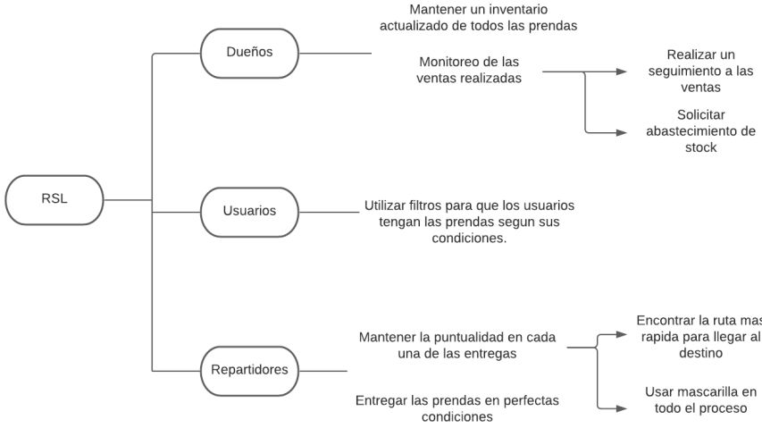

# **CAPÍTULO 1: INTRODUCCIÓN**
## *1.1 STARTUP PROFILE*
### 1.1.1 DESCRIPCIÓN DE LA STARTUP

  Nuestro equipo se llama “RSL” y buscamos mejorar o agilizar la forma en la que vendes tu ropa. Nuestra misión es crear una plataforma en la que cualquier tipo de persona pueda publicar sus prendas y estas sean separadas dependiendo las condiciones en las que se encuentren. 
  Nuestra visión es volvernos una empresa reconocida a nivel nacional y conseguir varios usuarios que usen nuestras plataformas como un medio para vender sus prendas de ropa. Además, nos gustaría ser reconocidos por brindar un muy buen servicio.

### 1.1.2 PERFILES DE INTEGRANTES
* Antonio Salazar, Jhan Clinton
   

   

    * *Ing. de Software*
    * **Acerca de:** Actualmente, soy estudiante de ingeniería de software. Me apasiona la tecnología y el desarrollo de soluciones innovadoras para mejorar la vida de las personas. Estoy emocionado de seguir aprendiendo y creciendo en este campo emocionante y en constante evolución.
* Sanchez Arenas, Manuel Angel
    * *Ing. de Software*
    * **Acerca de:** Soy una persona responsable.
    Puedo ayudar al equipo a escribir y presentar ideas
    innovadoras para los proyectos en curso que vamos a
    mostrar.
* Patrocinio Escalante, Leonardo Walt
   

   

    * *Ing. de Software*
    * **Acerca de:** Me considero una persona creativa,
    responsable y ordenada. Tengo experiencia trabajando en equipo,
    escucho las ideas de mis compañeros y me desempeño bien para
    el avance de los trabajos.
* Llamozas Diaz, Edson Diego
    
 
    

    * Ing. de Software
    * **Acerca de:** Me considero una persona responsable y
    optimista, capaz de trabajar en equipo. Me gusta jugar videojuegos
    y practicar algunos deportes como el fútbol o atletismo.
## *1.2 SOLUTION PROFILE*
NOMBRE DEL PRODUCTO: RSL MOBILE
### 1.2.1 ANTECEDENTES Y PROBLEMÁTICA

  Hoy en día, la industria de la moda es una de las más grandes que existen. Sin
embargo, se calcula que esta misma es responsable del 10% de las emisiones
mundiales de carbono, más que los vuelos internacionales y el transporte marítimo
combinados. Esto se traduce a que, por cada segundo, se entierra o quema una
cantidad de ropa que equivale a un camión lleno de basura. Por ello decidimos crear
una aplicación que facilite el proceso de venta de ropa de segunda mano y así
ayudar a mitigar el impacto ambiental que esta genera una vez desechada.
En el Perú, existen muchísimos emprendimientos que se dedican a la venta de ropa.
El lugar más conocido y a la vez concurrido es el Emporio de Gamarra. De esta
manera se pueden encontrar ropa por temporada hasta de segunda mano. Esta
última se ha popularizado mucho en nuestro país, tanto así que podemos encontrar
tiendas que se dedican exclusivamente a ello, como también perfiles por redes
sociales que quieran emprender en este rubro.
Debido a ello, tomamos la decisión de realizar una app que pueda ayudar a personas
que quieran vender cualquier tipo de vestimenta, así como también a las personas
que deseen realizar la compra de ropa de segunda mano.

### 1.2.2 LEAN UX PROCESS
### 1.2.2.1. LEAN UX PROBLEM STATEMENTS

* **PROBLEM STATEMENT #1:**
La aplicación busca brindar el servicio de venta de prendas de vestir de segunda mano a personas que se quieran deshacer de la ropa que ya no usen, además de ofrecer un sistema de delivery confiable y altamente seguro. En el día a día, una gran cantidad de personas desechan ropa que todavía se encuentra en un buen estado, generando así más contaminación y desperdiciando una posible ganancia. ¿Cómo lograr que estas personas cuenten con un servicio de fácil acceso para poder poner a la venta la ropa que ya no usen?

* **PROBLEM STATEMENT #2:**
Nuestra aplicación busca que las personas tengan un lugar seguro dónde puedan vender y comprar ropa de manera segura y eficaz para de este modo no tengan la preocupación de sentirse estafadas o no terminan con algo que realmente no tiene la calidad que esperaban. Para cualquier persona en el contexto actual en el que nos encontramos, tienen que darles mucha más importancia a sectores como la alimentación y la salud que a la vestimenta. De esta manera, en estos 2 últimos años, existen demasiadas personas que han preferido esta opción que es la compra de ropa de segunda mano por
internet. Sin embargo, muchas veces no resulta de la mejor forma, ya sea que la ropa recibida llega en mal estado o simplemente no llega. ¿De qué manera podemos mejorar la seguridad, la eficacia de la compra y venta de ropa de calidad y que sea de segunda mano?

### 1.2.2.2. LEAN UX ASSUMPTIONS
1. Creemos que muchas personas quieren vender la ropa que ya no usan, pero al no
contar con una forma sencilla de hacerlo las terminan desechando.
2. Los compradores no pueden sentirse seguros de la calidad de la ropa o de si la
talla es la adecuada al momento de comprar solo con ver fotos.
3. Este problema se puede solucionar con un sistema de devoluciones o cambio de
prenda por el mismo costo.
4. Muchas personas no van a comprar ropa de segunda mano presencialmente,
debido a la actual pandemia o a que la tienda se encuentra bastante alejado de su
domicilio.
5. Esto se puede solucionar con las entregas por delivery que se ofrecen a través de
la aplicación.
6. Creemos que existen muchas personas que quieran comprar ropa de segunda
mano por internet; sin embargo, aún no han encontrado alguna plataforma confiable
que se dedique exclusivamente a la ropa.
7. Esto se puede solucionar con un sistema de otorgamiento de estrellas según
cada venta que realice la persona en cuestión.
8. Gran parte de los vendedores posiblemente no hayan tenido éxito anteriormente
debido a su baja exhibición en otras plataformas o redes.
9. Muchos de estos emprendedores decidieron pertenecer a la aplicación, debido a
la buena exposición hacia los nuevos clientes.
10. Nuestra competencia principal serán las tiendas o emprendimientos
consolidados que se encuentran en otras plataformas.
11. La mejor manera de afrontar esto es convencerlos de que nuestra aplicación
tiene un mejor futuro, además de tener un mejor sistema de entrega de productos.

### 1.2.2.3. LEAN HYPOTHESIS STATEMENTS

* **PROBLEM STATEMENT #1:**
Creemos que logrando brindar a las personas un servicio de fácil acceso para que
pongan a la venta las prendas de vestir que no usen, incrementaremos la compra de
estos productos, ya que la gente que busca este tipo de ropa podrá encontrarla de
una manera más rápida.

* **PROBLEM STATEMENT #2:**
Creemos que con un sistema de filtro de venta de ropa de calidad y un sistema de
estrellas de calificación de reconocimiento por venta, las personas podrán estar
muchísimo más seguras de comprar por medio de nuestra aplicación. Sabremos que
hemos tenido éxito cuando la mayoría de nuestros vendedores tengan una buena
calificación, además de aumentar la cantidad de clientes de manera considerable.

### 1.2.2.4. LEAN UX CANVAS
| Sección | Descripción |
| --- | --- |
| **Business Problem**                    | **¿En qué negocio has identificado una necesidad?.** - Dificultad para poner a la venta ropa usada. - Dificultad por conseguir ropa de calidad, teniendo en cuenta que es usada. - Dificultad para comprar ropa en tiendas físicas, por tema de tiempo o distancia. |
| **Business Outcomes**                    | **¿Qué cambios en el comportamiento del cliente indicarán que tiene resuelto un problema real de manera que agrega valor a su compra?.** - La venta de ropa usada es más segura y sencilla. - El uso de la aplicación se impone a una presencial en tienda entre los usuarios. - Mayor facilidad al momento de comprar ropa de calidad y escoger alguna talla.|
| **Users and customers**                    | **¿En qué tipo de usuarios y clientes debería centrarse primero?.** - Personas que busquen ropa en calidad a un buen precio. - Personas que busquen comprar ropa a través de delivery. - Personas que tengan ropas de vestir que ya no usen. |
| **User benefits**                    | **¿Cuáles son los obejtivos que intentan alcanzar tus usuarios?** - Buscamos beneficiar en la compra de ropa usada, de cualquier talla, además contar con un servicio de delivery. |
| **Solutions**                    | **Enumere ideas de productos o características, que mejoren o ayuden a su obejtivo con la audiencia para lograr los beneficios que busca.** 1. Una aplicación en la que se pueda vender y comprar ropa usada entre usuarios. Además de implementar un sistema de calificación a los vendedores. 2. Lograr que los usuarios reciban su compra a tráves de delivery eficazmente. 3. Poder disminuir la cantidad de ropa quemada, ya que está contamina al medio ambiente. |
| **Hypotheses**                   | - Creemos que la venta segura y sencilla de ropa usada se logrará si las personas que buscan vender estás prendas utilicen nuestra aplicación. - Creemos que nuestros clientes podrán conseguir ropa usada de calidad, a través de nuestro sistema de calificación de vendedores. - Creemos que el sistema de delivery ayudará a la compra de ropa, ya que la mayoría de los usuarios prefiere recibir sus compras a través de este medio. |
| **What's the most important thing we need to learn firts?**                | - Aprender que la automatización de procesos como la venta de ropa usada debe ser más sencilla de usar, para que los usuarios la usen de manera sencilla. - Aprender que no solo un sistema de calificación puede determinar la confiabilidad de vendedor. - Aprender a solucionar los problemas de la aplicación de manera rápida y eficaz, para que los usuarios tengan una mejor interacción con esta. |
| **What's the least amount of work we need to do to learn the next most important thing?**                  | - Encuestas a los usuarios. - KPIS. - Entrevista a los usuarios. |

## 1.3 SEGMENTOS OBJETIVOS
Nuestra aplicación está dirigida a personas que buscan ropa de calidad a precios asequibles. Nuestro segmento objetivo incluye:

- Jóvenes adultos entre 18 y 35 años que buscan ropa de moda y de marca a precios reducidos.
- Personas preocupadas por el medio ambiente que prefieren comprar ropa de segunda mano para reducir su huella de carbono.
- Personas con un presupuesto limitado que buscan ropa de calidad a precios asequibles.

Nuestra aplicación ofrece una amplia selección de ropa de segunda mano en excelentes condiciones, desde prendas básicas hasta piezas de diseñador. Ofrecemos una experiencia de compra fácil y segura, con opciones de pago convenientes y envío rápido.

# **CAPÍTULO 3: REQUIREMENT SPECIFICATIONS**
## *3.1 TO-BE SCENARIO MAPPING*

### User Persona 01 - Cliente

|PHASES|ELECCIÓN DE PRENDA A COMPRAR|REVISAR DISPONIBILIDAD DE PRENDA|REALIZAR COMPRA|
|------|----------------------------|--------------------------------|---------------|
|DOING|Buscar en la aplicación RSL las prendas|Utilizar las funciones para seleccionar la prenda indicada|Seleccionar la prenda y comprarla|
|THINKING|"Me pregunto si podré conseguir las prendas"|"Espero encontrar las prendas lo más barato posible"|"Espero que se entreguen las prendas"|
|FEELING|Preocupado por encontrar las prendas|Nervioso por saber el precio de las prendas|Emocionado por que lleguen las prendas|

### User Persona 02 - Vendedor
|PHASES|RECIBIR ORDEN DE ENVÍO|LLEGAR A LA DIRECCIÓN DE ENTREGA|ENTREGAR PEDIDO|
|------|----------------------------|--------------------------------|---------------|
|DOING|Procesar el pedido de la prenda por la app RSL|Me dirijo a la dirección del cliente|Entrego el pedido|
|THINKING|"Me pregunto cuántos productos pedirán"|"Espero tener prendas suficientes"|"Espero llegue el repartidor a tiempo"|
|FEELING|Preocupado por si entregaré la prenda a tiempo|Nervioso por saber si tengo suficientes prendas|Satisfecho por realizar una buena venta|

### User Persona 03 - Repartidor
|PHASES|ELECCIÓN DE PRENDA A COMPRAR|REVISAR DISPONIBILIDAD DE PRENDA|REALIZAR COMPRA|
|------|----------------------------|--------------------------------|---------------|
|DOING|Recibir orden de envío y prepararla|Recoger la prenda y dirigirse a la zona de entrega|Realizar la entrega|
|THINKING|"Me pregunto si tendrá la prenda"|"Espero encontrar la prenda "|"Espero sea la prenda correcta"|
|FEELING|Preocupado por saber si llegaré a la hora indicada|Nervioso por saber si habrá prendas suficientes|Satisfecho por realizar una buena entrega|

## 3.2 *HISTORIAS DE USUARIO - www.RSL.com*

### EP01: GESTIÓN DE REGISTROS - ABASTECIMIENTOS

Como propietario de una aplicación que categoriza prendas de ropa subidas por los usuarios, quiero agregar proveedores a mi aplicación para que puedan anunciar sus productos de manera continua.

- **HU01: Confirmación de Registro**
  Como propietario de una aplicación de categorización de ropa, quiero recibir confirmación de registro por parte del usuario.

- **HU02: Aviso de Error**
  Como propietario de una aplicación de categorización de ropa, quiero recibir una notificación cuando un proceso de registro de usuario no se complete con éxito.

- **HU03: Retiro de negocios de la aplicación**
  Como jefe del departamento de ventas, quiero notificar y eliminar negocios de la aplicación que infrinjan las políticas de la aplicación.

### EP02: GESTIÓN DE REGISTROS - USUARIOS

Como propietario de una aplicación que categoriza prendas de ropa subidas por los usuarios, quiero agregar proveedores a mi aplicación para que puedan anunciar sus productos de manera continua.

- **HU04: Confirmación de Registro de perfil**
  Como propietario de una aplicación de categorización de ropa, quiero recibir confirmación de registro de perfil por parte del usuario.

- **HU05: Verificación de no ser un robot**
  Como propietario de una aplicación de categorización de ropa, quiero recibir una notificación cuando las cuentas que intentan acceder a la aplicación sean usuarios que no pasan la prueba de entrada básica.

- **HU06: Bloquear a clientes indeseables**
  Como jefe del departamento de ventas, quiero recibir notificaciones sobre clientes con informes para poder bloquear esas cuentas.
  
  ## 3.3 *IMPACT MAPPING*
  

  

  ## 3.4 *PRODUCT BACKLOG*
  ### HU01
  Debe mostrar una confirmación de registro del usuario.
  ### HU02
  Debe mostrar un aviso que indique cuando no se completa de manera exitosa un
  registro en la aplicación.
  ### HU03
  Debe permitir retirar de la aplicación a aquellos negocios que vayan en contra de las
  políticas de la aplicación.
  ### HU04
  Debe mostrar una confirmación de registro del usuario.
  ### HU05
  Debe mostrar un aviso que indique cuando las cuentas que intentan ingresar al
  aplicativo son usuarios que fallan la prueba básica de ingreso.
  ### HU06
  Debe mostrar notificaciones de los clientes que tengan reportes para poder bloquear
  esas cuentas.

# **CAPÍTULO 5: PRODUCT IMPLEMENTATION**
## *5.1 PRODUCT IMPLEMENTATION & DEPLOYMENT*

### Sprint 1

**Sprint Backlog 1**

| Sprint   | Historia de usuario     | Tareas                      | Estado    |
|----------|-------------------------|-----------------------------|-----------|
| SPRINT 1:Implementar la     interfaz de la landing page, así  como las páginas  de login y registro Registro de usuarios|                         |                             |           |
| HU01     |     | Elaborar prototipo          | Finalizado|
|          |                         | Implementar landing page | Finalizado|
|          |                         | Implementar página de  registro | En proceso|
| HU02     | Aviso de Error           | Validar email y contraseña   | En proceso|
|          |                         | Implementar aviso de error   | Pendiente |
| HU03     | Confirmación             | Mostrar mensaje de   confirmación        | En proceso|
|          | de registro de perfil
|          |                         | Almacenar email y contraseña | Pendiente |

### User Interface & Execution

En el Sprint 1 logramos prototipar las ventanas principales de la aplicación e implementar la landing page de nuestra aplicación.

### Team Collaboration Insights

- [nombre] realizó el prototipado de la aplicación utilizando Figma.
- [nombre]realizó la implementación de la landing page.

### VIDEO ABOUT THE PRODUCT

El video muestra el Happy User Flow al momento de iniciar sesión, registrarse, navegar por el menú principal y agregar productos al carrito.

Link: [Video sobre el producto](https://youtu.be/D72OJDVfnfE)

### 5.1.1 Software Development Environment Configuration

**Figma:**
Es un programa utilizado para el diseño de productos. Sobretodo es ideal para la creación de interfaces de usuario, tanto web como móvil. Además, también permite la creación de prototipos. Todas estas funcionalidades a través de su aplicación web. Decidimos utilizar esta herramienta ya que nos permite trabajar paralelamente sobre el mismo archivo, agilizando el tiempo de creación de las interfaces y prototipos.
Link: [Figma](https://www.figma.com/file/lfmNhtNWXtErN7awQ7emJw/Untitled?nodeid=0%3A1)

**GitHub:**
Es un repositorio online de código de aplicaciones que se están desarrollando. La plataforma fue creada para que los desarrolladores suban el código de sus aplicaciones. GitHub nos provee de una fuente donde almacenar y verificar los cambios en nuestro código de una manera transparente. Además, nos facilita el poder volver atrás si ocurre un error en la aplicación.
Link: [GitHub Repository](https://github.com/JhonelRios/ihc-2021-landingpage)

**Trello:**
Es un software de administración de proyectos a través de una interfaz web o móvil. Optamos por esta aplicación ya que nos permite designar tareas a cada integrante del grupo de una manera sencilla y nos permite visualizar en qué estado se encuentra dicha tarea.

### 5.1.2 Source Code Management

En nuestro proyecto aplicaremos GitFlow de la siguiente manera:

- **Main:** La rama principal donde se encontrará la aplicación totalmente funcional. A esta rama se le hará merge de la rama de Develop.
- **Develop:** En esta rama nos centraremos en probar nuevas funcionalidades y asegurarnos de que no generan errores con la aplicación actual.
- **Feature:** Pueden existir varias ramas de este tipo, donde cada una de ellas se encarga de una funcionalidad específica de la aplicación.

### 5.1.3 Source Code Style Guide & Conventions

**HTML y CSS:**
En el caso de estas 2 tecnologías decidimos utilizar la guía de estilos que provee Google, ya que consideramos que es sencilla de entender y mantiene una buena legibilidad en el código. Las principales reglas que da son:
- Usar una indentación de 2 espacios.
- Solo usar letras minúsculas.
- Remover espacios sobrantes.
- Agregar comentarios al código cuando sea necesario.
Link: [Guía de Estilos HTML y CSS de Google](https://google.github.io/styleguide/htmlcssguide.html)

**JavaScript:**
En el caso de JavaScript optamos por seguir la guía de estilos de AirBnB, ya que es de las más utilizadas y recomendadas en el desarrollo frontend. Las principales reglas son:
- Utilizar punto y coma al final de cada bloque de código.
- Agregar comentarios al código cuando sea necesario.
- Después y antes de utilizar un operador matemático debemos agregar espacios.
- Las variables deben tener nombres que las identifiquen claramente.
Link: [Guía de Estilos JavaScript de AirBnB](https://github.com/airbnb/javascript)

